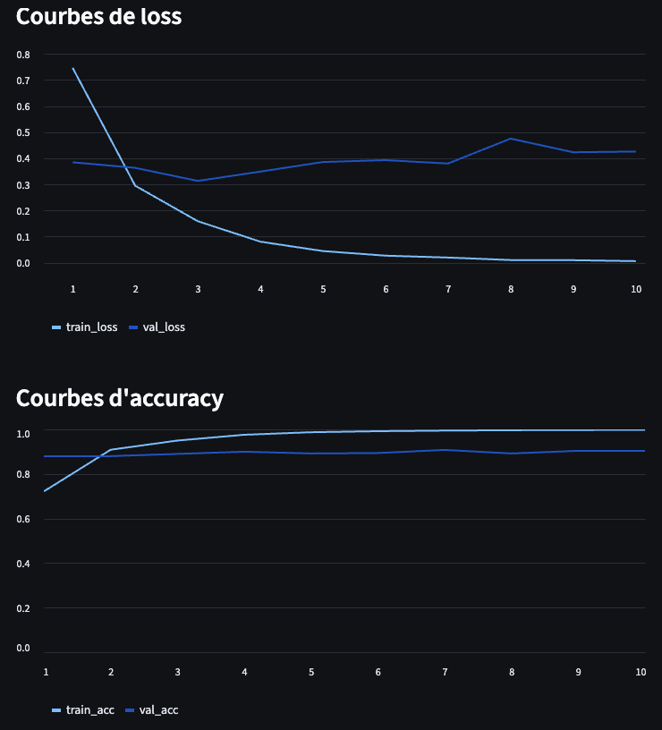
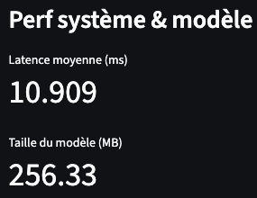

🚀 Projet NLP complet avec PyTorch – Pipeline de bout en bout

Ce projet met en place un pipeline NLP complet, du dataset jusqu’au déploiement API, en utilisant PyTorch, Transformers, et FastAPI.

📥 Dataset en ligne (HuggingFace)

Le projet utilise le dataset AG News directement depuis
datasets.load_dataset("ag_news").

🧠 Modèle NLP : DistilBERT + PyTorch

Un modèle Transformer pré-entraîné (distilbert-base-uncased) est utilisé pour :

la classification de texte

avec 4 classes (World, Sports, Business, Sci/Tech)

entraîné via PyTorch (train_nlp.py)

📊 Pipelines d’évaluation & métriques

Pendant l’entraînement :

accuracy (train & validation)

loss (train & validation)

taille du modèle sauvegardé

fichiers produits :

metrics.json (courbes d'entraînement)

system_metrics.json (latence, taille, énergie…)

⚡ Benchmarking (benchmark_nlp.py)

Mesure :

latence moyenne (ms) par prédiction

optionnel : énergie consommée via CodeCarbon

📈 Dashboard Streamlit (dashboard_nlp.py)

Interface visuelle pour observer les métriques :

Courbes loss / accuracy

Mesures système :

latence

taille du modèle

énergie (optionnelle)

Outputs :

📊 Dashboard entraînement :

📉 Mesures système

🌐 Déploiement via API (FastAPI)

L’API (api_nlp.py) permet d’envoyer un texte et de recevoir :

le label prédit

l’ID de classe

la confiance

les probabilités complètes

🧪 Exemple d'appel API

Commande :
1- python train_nlp.py
2- python benchmark_np.py
3- streamlit run dashboard_nlp.py 
4- LANCER API: uvicorn api_nlp:app --host 0.0.0.0 --port 8000

5- curl -X POST "http://localhost:8000/predict" \
    -H "Content-Type: application/json" \
    -d '{"text": "Apple releases a new iPhone with amazing features."}'

Réponse :

{
  "text": "Apple releases a new iPhone with amazing features.",
  "predicted_label": "Sci/Tech",
  "label_id": 3,
  "confidence": 0.9964354038238525,
  "probabilities": {
    "World": 0.001184765249490738,
    "Sports": 0.00024183574714697897,
    "Business": 0.0021379576064646244,
    "Sci/Tech": 0.9964354038238525
  }
}